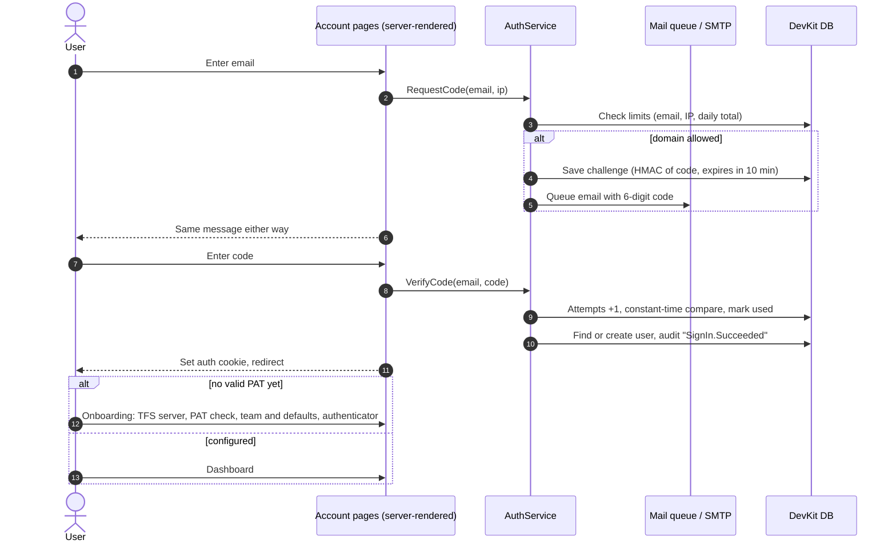
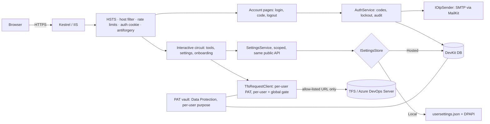

# DevKit: Hosted Multi-User Login Analysis

> **Status:** analysis for review. No application code was changed.
> **Date:** 2026-10-02 · **Branch:** `new_ui_v1` (working tree, including uncommitted files) · **Scope:** all of `DevKit.Web` and `DevKit.Tests`
> **Baseline:** 394 of 394 tests pass (`dotnet test`, SDK 10.0.401). The build went to a scratch folder so the two DevKit instances running from `bin/` were not touched.
> **uzera:** not used, online or offline. Only native tools were used. DevKit's `.claude/settings.local.json` still has `disableAllHooks`, `deniedMcpServers: uzera` and `permissions.deny: mcp__uzera`. Every global uzera hook goes through `uzera-hook.cmd`, whose only allowed root is `fxmigration-workspace`. No hook fired in this session.

---

## 0. Read this first: the deployed copy is open today

DevKit was built as a single-user app on `localhost`. [README.md:192](../../README.md#L192) says it is "not as a shared/hosted service". It has **no login**. On the domain where it runs now, anyone who can open the URL can do the following.

| # | What a visitor can do | Why | Evidence |
|---|---|---|---|
| 1 | Act as the person whose PAT is saved. They can create and delete branches, link and unlink work items, create tasks and change sizes, and TFS records it all under that person's name. | One global settings object holds one PAT for every visitor. | [Program.cs:33](../../DevKit.Web/Program.cs#L33) |
| 2 | Read the PAT itself. | Settings loads the decrypted PAT into the password box, and prerendering writes it into the page HTML as `value="…"`. **Verified** on the local instance at port 5850: the `/settings` HTML holds a 52-character value in the password field. The value was not printed. | [Settings.razor.cs:34](../../DevKit.Web/Components/Pages/Settings.razor.cs#L34), [Settings.razor:22](../../DevKit.Web/Components/Pages/Settings.razor#L22) |
| 3 | Steal the PAT another way: change *Server URL* to a server they control, and DevKit's next call sends `Authorization: Basic <PAT>` there. The same field can make the server call internal addresses (SSRF). | Any http(s) URL is accepted, and the auth header goes on every request. | [Settings.razor.cs:117-133](../../DevKit.Web/Components/Pages/Settings.razor.cs#L117), [TfsRequestClient.cs:61-76](../../DevKit.Web/Services/TfsRequestClient.cs#L61) |
| 4 | Make the server read its own disk or connect out to another machine. *Default Project Path* accepts any path, including UNC (`\\host\share`). The Merge Tool then runs `git fetch / checkout / pull / cherry-pick / push` there with the **server's** git credentials, and it can start `cmd.exe`, `devenv` and `explorer` on the server. | Local-machine features run wherever DevKit runs. | [SettingsService.Repos.cs:118-151](../../DevKit.Web/Services/SettingsService.Repos.cs#L118), [GitCommandService.cs:31-135](../../DevKit.Web/Services/GitCommandService.cs#L31), [MergeTool.razor.cs:302-328](../../DevKit.Web/Components/Pages/MergeTool.razor.cs#L302) |

**Recommended now.** These are operations steps, and they are your call; nothing has been changed.
1. Restrict the deployed URL (VPN, IP allow-list or Windows auth in IIS), or stop it until the login ships.
2. If a PAT was ever saved on that server, revoke it in TFS (*User settings → Personal access tokens*) and create a new one.
3. Check TFS history for branch deletions or creations, work item edits or tasks you did not make.
4. Keep using DevKit on `localhost` until hosted mode is ready.

---

## 1. Summary

**What we found**
- DevKit is single-user by design in five places:
  - one global `SettingsService` with one PAT (a singleton),
  - one settings file next to the binary,
  - one process-wide TFS gate,
  - features that use the local disk (repo scan, git),
  - no identity anywhere (no auth middleware, no `AuthorizeRouteView`).
- Much of the existing code is solid and reusable: one TFS request client for auth, paging and errors, WIQL escaping, ref and SHA validation, a CSP, DPAPI encryption at rest, a path-confinement helper, `IProgress<T>` progress, and 394 tests with a fake TFS server.
- **26 issues**, listed in section 3: 5 critical when hosted, 6 high, 9 medium and 6 low. Several of them are bugs on localhost too.

**What we propose**
- **Two modes**, chosen once at startup:
  - **Local** keeps today's behaviour unchanged and refuses to be exposed beyond localhost.
  - **Hosted** requires login and makes everything per user.
- **Sign-in:** email plus a one-time code (passwordless), built on ASP.NET Core Identity, which ships with .NET and provides lockout, security stamps, authenticator apps and passkeys. Sign-in pages are server-rendered forms, because Blazor can't set a login cookie over its live connection.
- **First login:** a short onboarding wizard.
  - The user enters a PAT. It is checked against TFS, stored encrypted per user, and never shown again.
  - The user sets their team and defaults.
  - Recommended: the user adds an authenticator app, so later logins don't need email.
- **PAT security:**
  - Encrypted with ASP.NET Core Data Protection under a per-user purpose.
  - Write-only in the UI.
  - The TFS server is picked from an admin allow-list.
  - Never logged.
- **Beta:**
  - In hosted mode, the Merge Tool and the local repository scan are hidden for everyone. They can't work there, because the server can't see users' disks.
  - In local mode they appear as *Beta*, and only when switched on.
- **Free OTP:**
  - One SMTP sender that works with any mail provider.
  - Use your company mail server if IT allows an app mailbox; otherwise Brevo's free plan (300 emails/day).
  - Add authenticator-app codes, which are free and need no sending at all.
  - Avoid SMS.

**What we need from you:** the 12 decisions in [section 12](#12-decisions-needed-from-you). The most important are login strength (D1), who can sign up (D2), mail transport (D3), database (D4), package policy (D5) and how the server is deployed (D6).

---

## 2. How DevKit works today

- **Runtime:** .NET 10 Blazor Server. Every page is interactive ([App.razor:17](../../DevKit.Web/Components/App.razor#L17)) and prerendering is on. The app uses no NuGet packages.
- **State:**
  - `SettingsService` is a singleton that reads and writes `usersettings.json` in `AppContext.BaseDirectory`.
  - The PAT is encrypted with Windows DPAPI for the current Windows user.
  - `PageStateService` and `BranchCacheService` are per circuit (one per browser tab).
- **TFS:** every call goes through `TfsRequestClient`, which adds Basic auth with the PAT, no-cache headers and TFS error text. Calls also pass a static gate of 5 concurrent calls, shared by the whole process.
- **Local git:** `GitCommandService` runs the `git` CLI in folders found by scanning *Default Project Path*.

| Tool | Route | Reads TFS | Writes TFS | Uses server disk or git | Works hosted after login? |
|---|---|---|---|---|---|
| Dashboard | `/` | – | – | – | Yes |
| Workday Calculator | `/workday` | – | – | – | Yes |
| Markdown Viewer | `/markdown` | – | – | – (runs in the browser) | Yes |
| Branch Creator | `/branch-creator` | ✓ | creates branches, links and unlinks work items | – | Yes |
| TFS Insight Hub | `/insights` | ✓ | creates tasks, updates sizes | – | Yes |
| Code Merging Sheet | `/code-merging` | ✓ | – | – | Yes |
| Branch Delete | `/branch-delete` | ✓ | deletes branches | – | Yes |
| **Merge Tool** | `/merge` | ✓ | pushes (through local git) | ✓ scan, fetch, checkout, pull, cherry-pick, push; opens Visual Studio | **No: Beta, local mode only** |
| Settings | `/settings` | ✓ | – | ✓ *Default Project Path* and *Local Repositories* | Yes, without the local sections |

---

## 3. Issues found in the current code

Severity is rated for **hosted** use. *Phase* says where the fix lands (see [section 10](#10-delivery-plan)). Items marked *(local too)* are bugs even on localhost.

### Critical: must be fixed before hosting

| ID | Issue | Evidence | Phase |
|---|---|---|---|
| C1 | No authentication or authorization anywhere: there is no `AddAuthentication`, and the router uses `RouteView`, not `AuthorizeRouteView`. | [Program.cs:32-42](../../DevKit.Web/Program.cs#L32), [Routes.razor:3](../../DevKit.Web/Components/Routes.razor#L3) | 2 |
| C2 | The decrypted PAT is sent to the browser and written into the prerendered HTML. *(local too; verified on port 5850)* | [Settings.razor.cs:34](../../DevKit.Web/Components/Pages/Settings.razor.cs#L34), [Settings.razor:22](../../DevKit.Web/Components/Pages/Settings.razor#L22) | 1 |
| C3 | The TFS URL is free text. The PAT goes to whatever host is entered, and the server can be made to call internal addresses (SSRF). | [Settings.razor.cs:117-133](../../DevKit.Web/Components/Pages/Settings.razor.cs#L117), [TfsRequestClient.cs:27](../../DevKit.Web/Services/TfsRequestClient.cs#L27), [TfsRequestClient.cs:61-65](../../DevKit.Web/Services/TfsRequestClient.cs#L61) | 3 |
| C4 | One global settings object and one PAT serve all users. Any change applies to everyone, and TFS history shows one person for every action. | [Program.cs:33](../../DevKit.Web/Program.cs#L33), [SettingsService.cs:22](../../DevKit.Web/Services/SettingsService.cs#L22) | 3 |
| C5 | The browser can trigger server-side disk and process access. Any path is scanned, including UNC paths. Git runs with the server's credentials. `cmd.exe /c start devenv` and `explorer.exe` start on the server. Running git inside a folder someone else controls is a known code-execution route (repository hooks and config); git's `safe.directory` check reduces that risk but doesn't remove it. | [SettingsService.Repos.cs:118-151](../../DevKit.Web/Services/SettingsService.Repos.cs#L118), [GitCommandService.cs:31-135](../../DevKit.Web/Services/GitCommandService.cs#L31), [MergeTool.razor.cs:302-328](../../DevKit.Web/Components/Pages/MergeTool.razor.cs#L302) | 1 (hide) |

### High

| ID | Issue | Evidence | Phase |
|---|---|---|---|
| H1 | *Test Connection* saves permanently. The comment says "temporarily", but the code calls `SaveTfs`. In shared use, one person's test replaces everyone's PAT. *(local too)* | [Settings.razor.cs:102-103](../../DevKit.Web/Components/Pages/Settings.razor.cs#L102) | 1 |
| H2 | Shared settings are changed from several tabs or users without locks (`Dictionary` and `List` writes); only Capacity Planning is locked. The whole file is rewritten in place on every change, so a crash mid-write can leave a broken file. The next start then quietly falls back to defaults, logs only a Warning, and the next save overwrites the file. *(local too, with several tabs)* | [SettingsService.cs:188-192](../../DevKit.Web/Services/SettingsService.cs#L188), [SettingsService.cs:239-250](../../DevKit.Web/Services/SettingsService.cs#L239), [SettingsService.cs:268-272](../../DevKit.Web/Services/SettingsService.cs#L268), [SettingsService.Repos.cs:59-69](../../DevKit.Web/Services/SettingsService.Repos.cs#L59) | 3 |
| H3 | Settings and the PAT live next to the binary. A redeploy can remove them, IIS app folders are usually read-only, and DPAPI "current user" needs a loaded profile for an app-pool account. On non-Windows hosts the PAT is saved **in plain text**. | [SettingsService.cs:22](../../DevKit.Web/Services/SettingsService.cs#L22), [SecretProtector.cs:23](../../DevKit.Web/Services/SecretProtector.cs#L23) | 3 |
| H4 | The production error handler points to `/Error`, but no Error page exists and the router has no NotFound content. A server error shows a blank or 404 page with no reference number. | [Program.cs:48](../../DevKit.Web/Program.cs#L48), [Routes.razor](../../DevKit.Web/Components/Routes.razor) | 1 |
| H5 | One process-wide TFS gate allows 5 calls at a time. With several users, one large Code Merging Sheet run makes everyone else wait; the comment says the sharing is "by design". | [CodeMergingHelpers.cs:259-283](../../DevKit.Web/Services/CodeMergingHelpers.cs#L259) | 3 |
| H6 | Empty catches and an `async void` handler, which block review rule CRULE-00001. The Merge Tool hides load and git failures, and the dropdown components have 9 empty `catch (JSException) {}` blocks. | [MergeTool.razor.cs:68](../../DevKit.Web/Components/Pages/MergeTool.razor.cs#L68), [:105](../../DevKit.Web/Components/Pages/MergeTool.razor.cs#L105), [:143](../../DevKit.Web/Components/Pages/MergeTool.razor.cs#L143), [:170](../../DevKit.Web/Components/Pages/MergeTool.razor.cs#L170), [:319-327](../../DevKit.Web/Components/Pages/MergeTool.razor.cs#L319); [BranchPicker.razor:100](../../DevKit.Web/Components/BranchPicker.razor#L100), [GlassDropdown.razor:169](../../DevKit.Web/Components/GlassDropdown.razor#L169), [MultiSelectDropdown.razor:110](../../DevKit.Web/Components/MultiSelectDropdown.razor#L110) (and two more in each) | 1, or when the file is next touched |

### Medium

| ID | Issue | Evidence | Phase |
|---|---|---|---|
| M1 | The conflict dialog's HTML is built by hand: `branch` and the short SHA are not encoded before `MarkupString`. Git branch names may contain `<` and `>`. The CSP stops scripts, so the effect is injected markup, not script. | [MergeTool.razor.cs:287-289](../../DevKit.Web/Components/Pages/MergeTool.razor.cs#L287), [MergeTool.razor:273](../../DevKit.Web/Components/Pages/MergeTool.razor#L273) | 4 (beta) |
| M2 | Every full page load reads TFS twice: prerendering runs `OnInitializedAsync`, then the live circuit runs it again. For example, Settings loads projects, repositories, areas and sprints twice. | [App.razor:17](../../DevKit.Web/Components/App.razor#L17), [Settings.razor.cs:31-63](../../DevKit.Web/Components/Pages/Settings.razor.cs#L31), [MergeTool.razor.cs:50-82](../../DevKit.Web/Components/Pages/MergeTool.razor.cs#L50) | 3 |
| M3 | TFS calls run in loops. Areas and sprints are loaded per project, one after another. The Merge Tool asks every repository for pull requests, then asks each matching pull request for its commits. | [Settings.razor.cs:49-53](../../DevKit.Web/Components/Pages/Settings.razor.cs#L49), [MergeTool.razor.cs:61-65](../../DevKit.Web/Components/Pages/MergeTool.razor.cs#L61), [MergeTool.razor.cs:203-231](../../DevKit.Web/Components/Pages/MergeTool.razor.cs#L203) | 3 / 4 |
| M4 | Logging. 43 calls log a caught exception at Warning, Debug or Information, but CRULE-00001 wants Error. No correlation id or user id is attached to log entries, and both are needed once there are many users. | e.g. [TfsApiService.cs:85](../../DevKit.Web/Services/TfsApiService.cs#L85), [SettingsService.cs:270](../../DevKit.Web/Services/SettingsService.cs#L270) | when the file is next touched |
| M5 | Settings shows the raw exception text to the user, although `TfsErrors.Describe` already turns TFS errors into safe messages. | [Settings.razor.cs:84](../../DevKit.Web/Components/Pages/Settings.razor.cs#L84), [Settings.razor.cs:111](../../DevKit.Web/Components/Pages/Settings.razor.cs#L111), [CodeMergingHelpers.cs:235-257](../../DevKit.Web/Services/CodeMergingHelpers.cs#L235) | 3 |
| M6 | Git process handling has four problems. Stdout is read fully before stderr, which can deadlock. There is no timeout or cancellation. Credential prompts are not disabled, so a server can hang waiting for one. The full git output is logged. | [GitCommandService.cs:161-182](../../DevKit.Web/Services/GitCommandService.cs#L161) | 4 (beta) |
| M7 | Sizing for many users. Up to 200 disconnected circuits are kept for 30 minutes, each holding its loaded sheets. `MaximumReceiveMessageSize` is 5 MB; the comment cites render batches, but this limit applies to messages the server *receives*. It only raises how much any client can make the server buffer. | [Program.cs:19-20](../../DevKit.Web/Program.cs#L19), [Program.cs:29](../../DevKit.Web/Program.cs#L29) | 2 |
| M8 | Company-specific values are in the code, though the product is meant to be open source: excluded area names, a `tfs.casepoint.in` placeholder, and "TFS · Casepoint" in the sidebar. | [TfsApiService.cs:24-27](../../DevKit.Web/Services/TfsApiService.cs#L24), [Settings.razor:18](../../DevKit.Web/Components/Pages/Settings.razor#L18), [MainLayout.razor:9-12](../../DevKit.Web/Components/Layout/MainLayout.razor#L9) | 1 |
| M9 | Hosted-mode hardening is missing. `AllowedHosts` is `"*"`. There is no HTTPS redirect or HSTS. The CSP allows `img-src http:` and `connect-src ws:`. There is no rate limiting. | [appsettings.json:8](../../DevKit.Web/appsettings.json#L8), [Program.cs:46-78](../../DevKit.Web/Program.cs#L46) | 2 |

### Low

| ID | Issue | Evidence | Phase |
|---|---|---|---|
| L1 | Dead config: `Tfs:ApiVersion` in appsettings.json is never read, because the version comes from usersettings.json. The README says it is configurable there. | [appsettings.json:9-11](../../DevKit.Web/appsettings.json#L9), [README.md:138](../../README.md#L138) | 1 |
| L2 | Unused code: nothing references `RepoPathSettings`, and `ThemeService` is registered but never injected. | [RepoPathSettings.cs](../../DevKit.Web/Models/RepoPathSettings.cs), [ThemeService.cs](../../DevKit.Web/Services/ThemeService.cs), [Program.cs:34](../../DevKit.Web/Program.cs#L34) | 1 |
| L3 | A getter writes to disk: `CapacityPlanning` migrates and saves on its first read. | [SettingsService.cs:205-220](../../DevKit.Web/Services/SettingsService.cs#L205) | 3 |
| L4 | Stale comment: .gitignore says the PAT in usersettings.json is plain text, but it is DPAPI-encrypted. | [.gitignore:7](../../.gitignore#L7) | 1 |
| L5 | The README describes a local-only tool. It needs deployment and security sections for hosted mode. | [README.md:187-195](../../README.md#L187) | 6 |
| L6 | The tests share one usersettings.json, so they must run one class at a time (`SettingsFileCollection`). A store abstraction would let them run in parallel. | [SettingsFileCollection.cs](../../DevKit.Tests/SettingsFileCollection.cs) | 3 |

**What we keep and reuse:**
- `TfsRequestClient` (one place for auth) and `TfsErrors.Describe`
- `WiqlEscape`, `IsValidRef` and `IsValidSha`, and `ArgumentList` (no shell)
- the CSP and security headers
- `IsConfinedRegularFile` (path confinement)
- `BranchCacheService` (shared in-flight loads) and `GitRefUpdate` (per-branch outcomes)
- `IProgress<T>` progress records and `CancellationSources`
- `ToolCatalog`, which already feeds the sidebar, dashboard and search from one list
- the setup guard in `MainLayout`, and the glass UI components
- `FakeGitServer` for tests

---

## 4. The new feature: what each request means technically

| # | Your request | What it means in code |
|---|---|---|
| R1 | A global tool with a login module | Authentication middleware, a user store, a sign-in UI, authorization on every page and on the live connection, sign-out, and session lifetime. |
| R2 | First configuration at first login, plus PAT security | A first-login wizard that reuses the Settings components. The PAT is stored encrypted **per user**, checked against TFS, never sent back to the browser, and removable. The TFS server is picked from an admin list. |
| R3 | Simple email login with OTP verification, at no cost | Passwordless email plus a 6-digit code, and a mail sender that works with free providers or your own mail server. Limits stop anyone flooding an inbox or using up the free quota. |
| R4 | Very high security, with each user's own PAT and configuration | Everything that is global today becomes per user: settings, PAT, cached TFS data and the TFS-call allowance. Add an audit trail and hardening (HTTPS, cookies, CSP, rate limits, lockout). |
| R5 | Personal repository scan and Merge Tool only as beta | A tool "stage" (Stable or Beta) in `ToolCatalog`, a feature switch, and an authorization policy on the route. Local-disk features never run in hosted mode. |

**About "first time cross verification":** an email address alone is not a secret, so every *new* session needs a code, an authenticator or a passkey. What can be "first time only" is the **check that the user owns the email**. After that, "Remember this device for 30 days" keeps codes rare. [D1](#12-decisions-needed-from-you) asks which strength you want.

**About "machine-wise configuration":** in hosted mode the server cannot see the user's disk. The settings that point at local folders (*Default Project Path* and local repo mapping) can't work there. Everything else becomes **per user**: TFS defaults, team, branches, pinned repositories and capacity rules. Please confirm this ([D7](#12-decisions-needed-from-you)).

---

## 5. Challenges this feature brings, and how we handle each

| Challenge | Why it is hard here | How we handle it |
|---|---|---|
| Blazor and login cookies | Pages run over a live SignalR connection, and a cookie can only be set on a normal HTTP response. | The account pages (login, code, logout) render as plain server forms with `[ExcludeFromInteractiveRouting]`, and `App.razor` chooses interactive mode per page. This is the same pattern the .NET Blazor Identity template uses. |
| Single-user assumptions | Settings are a singleton, the TFS gate is static, there is one settings file, and git runs locally. | Per-user scoped services behind the **same public API**, so the 13 files that use `SettingsService` don't change. |
| Local-only tools | The server can't reach users' clones. | Hidden in hosted mode; beta in local mode. A possible future option, to be checked against your TFS version: TFS's server-side cherry-pick API would allow a hosted Merge Tool without local clones. |
| Secrets on a shared server | Many PATs sit in one place, and the encryption keys must survive restarts. | Data Protection keys are kept in a protected folder and encrypted with machine DPAPI or a certificate. Each user gets their own encryption purpose. There is a documented backup procedure. |
| Free email limits and spam folders | Free plans cap daily volume, and mail from unknown senders lands in spam. | A daily-cap guard, remembered devices and an authenticator app. Mail is sent from a verified domain (SPF/DKIM). |
| Microsoft 365 SMTP | Basic-auth SMTP will be **disabled by default at the end of December 2026**. Admins can re-enable it for now; the final removal date is due to be announced in 2027. | Use OAuth2 SMTP (MailKit supports it) or an IP-based connector, not a mailbox password. |
| Abuse | Code requests can be used to flood someone's inbox or to test which emails exist. | Allowed domains, the same response for every address, per-email, per-IP and daily limits, and queued sending so response timing reveals nothing. |
| Several tabs per user | Each tab holds its own copy of the settings, so the last save wins. | Small writes that update one field and carry a concurrency token. On a conflict, reload and re-apply the change. |
| Server sizing | Circuits hold large sheets, and TFS throttles busy identities. | Measure first, then set circuit retention. Use a per-user TFS gate under a global one. |
| Package policy | The app has zero packages today, and a database and a modern mail client both need some. | Only Microsoft packages plus MailKit (MIT), with pinned versions and CVE checks ([D5](#12-decisions-needed-from-you)). |
| Existing local users | You and others run DevKit locally. | Local mode stays the default and behaves as it does today. |
| PAT expiry | On-premises TFS doesn't report when a PAT expires. | Treat a 401 as "PAT rejected": stop the operation, mark the PAT, and ask for a new one. An optional expiry date can drive reminders. |

---

## 6. Free OTP delivery: options and recommendation

Checked in October 2026. Free tiers change, so check again before go-live.

| Option | Cost | Free limit | What you need | Verdict |
|---|---|---|---|---|
| **Your company mail server** (Exchange, Microsoft 365, or an on-premises SMTP relay) | Already paid for | Microsoft 365: 10,000 recipients/day per mailbox | IT creates a sender mailbox and allows OAuth2 SMTP or a relay connector | **Best, if IT agrees** |
| **Brevo** (SMTP relay) | Free plan, no expiry | 300 emails/day | Verify your sending domain (SPF/DKIM) | **Best free third-party option** |
| Mailjet | Free plan | 200/day, 6,000/month | Domain verification | Good alternative |
| Resend | Free plan | 100/day, 3,000/month | Domain verification | Fine for small teams |
| Mailgun | Free plan | 100/day | Domain verification | Fine for small teams |
| Gmail or Google Workspace SMTP | Free with the account | 500 recipients/day (Gmail), 2,000 (Workspace) | 2-step verification and an app password | Development or fallback only |
| Amazon SES | Credits for new accounts, then paid | – | An AWS account | Not free long-term |
| SendGrid | Free plan retired in May 2025; 60-day trial only | – | – | Not recommended |
| **Authenticator app (TOTP)** | Free, nothing to send | Unlimited | The user installs Microsoft Authenticator, Google Authenticator, FreeOTP, Aegis or similar | **Recommended main factor after the first login** |
| Passkeys (built into .NET 10 Identity) | Free | Unlimited | HTTPS and a modern browser | Later phase |
| SMS | Paid everywhere | – | – | Not recommended (cost, SIM-swap risk; NIST restricts it) |
| Running your own outbound mail server (Postfix, hMailServer) | Free software | – | A static IP with a good reputation, port 25 open, SPF/DKIM/DMARC, reverse DNS | Not recommended (mail goes to spam) |

**Recommendation**
- Build one `IOtpSender` with an SMTP implementation (MailKit). Every provider above speaks SMTP, so the same code works with your company server, Brevo or anything else. Nothing is tied to one vendor, which suits an open-source product.
- Use the company server if it is available; otherwise use Brevo's free plan.
- Make the authenticator app the normal way to sign in after the first login. Email is then needed only for the first sign-in and for recovery. NIST SP 800-63B does not accept email as an out-of-band authenticator, so email alone shouldn't be the only factor for a "very high security" target.
- For development, a "pickup folder" sender writes each email to disk instead of sending it.

**Why MailKit rather than .NET's built-in `SmtpClient`:** Microsoft's own documentation advises against `SmtpClient` for new development because it lacks modern protocols, and points to MailKit, which also supports the OAuth2 SMTP that Microsoft 365 will need.

**Alternatives considered**
- **Windows sign-in (Kerberos) through IIS:** free and needs no codes, but only works inside your Windows domain.
- **Microsoft Entra ID or any OpenID Connect provider:** company single sign-on with its own MFA, using one more Microsoft package. This is a good optional provider for a later phase.
- **Self-hosted Keycloak:** open source, but it is another server to run.

---

## 7. Proposed design

### 7.1 Two modes, chosen once at startup

`DevKit:Mode` is `Local` (the default) or `Hosted`. `Program.cs` reads it once, and dependency injection registers the matching implementations. This is the strategy pattern, so no `if (hosted)` checks end up scattered through the pages.

| | Local (today) | Hosted (new) |
|---|---|---|
| Login | none | required (email plus code) |
| Settings store | `usersettings.json` with DPAPI (unchanged) | database, one row per user |
| PAT protection | DPAPI, current user | Data Protection, per-user purpose |
| TFS server | typed in | picked from an admin list |
| Merge Tool and local scan | Beta; off unless switched on | never available |
| Exposure guard | refuses to start on a non-loopback address, and rejects non-local `Host` or forwarded headers | HTTPS, HSTS, `AllowedHosts` set to your domain |

The exposure guard is what would have prevented today's situation: a local build can no longer be published on a domain by accident.

### 7.2 Sign-in

- **ASP.NET Core Identity**, which ships with .NET, provides users, roles (`Admin`, `BetaTester`), lockout, a security stamp, authenticator keys, recovery codes and passkeys. It is stored with EF Core ([D4](#12-decisions-needed-from-you)).
- **Passwordless:** no passwords are stored, so there is nothing to reset.
- **Cookie:** `__Host-DevKit`, set `HttpOnly`, `Secure` and `SameSite=Lax`. Strict would sign users out whenever they follow a link from Teams, email or TFS; the antiforgery checks already cover form posts. The session lasts 8 hours and slides with activity, or 30 days when "Remember this device" is ticked.
- **Pages:** `/account/login` (email), `/account/code` (code) and `/account/logout` (POST only). They are server-rendered and protected by antiforgery. The POSTs go to small endpoints, so rate limits apply exactly where they're needed.
- **The whole app is protected:** a fallback policy requires an authenticated user, and the router uses `AuthorizeRouteView`. Only the account pages, `/healthz` and static files are anonymous. The Blazor hub also requires a signed-in user.
- **Live sessions are re-checked:** `RevalidatingServerAuthenticationStateProvider` re-checks the security stamp on a fixed interval (the template uses 30 minutes; we'd use about 5 to 10). "Sign out everywhere", disabled accounts and role changes therefore reach tabs that are already open.
- **Lockout:** 10 wrong codes lock the account for 15 minutes; both numbers are configurable.

### 7.3 One-time code rules

- **Generation:** 6 digits from `RandomNumberGenerator`.
- **Storage:** only an HMAC-SHA256 of the code is stored, keyed with a server secret, and it is compared in constant time.
- **Lifetime:**
  - valid for 10 minutes, and **single use**,
  - 5 attempts per code,
  - a new code cancels the old one,
  - resend allowed after 60 seconds.
- **Limits:**
  - 5 codes an hour and 10 a day per email,
  - per-IP limits,
  - a **daily total** kept below the provider quota (for example 250 for Brevo's 300), with an Error log when it is reached.
- **No hints:** every address gets the same answer and the same timing ("If this address can sign in, we've sent a code"), because codes go out through a bounded background queue.
- **Email content:** plain text with no links. It holds the code, the expiry, and "ignore this if it wasn't you".
- **Why not Identity's built-in email code:** it is a time-window code. It stays valid for several minutes and is not marked as used, so a stolen code can be replayed within the window. Our own challenge row makes each code single use and lets us count attempts.

### 7.4 Instance setup (one time, by the server admin)

This is done through configuration, not a public web wizard: a page where the first visitor sets up the server is a takeover risk. The settings are:
- `DevKit:Auth:AllowedEmailDomains`, and `DevKit:Auth:AdminEmails` (those addresses get the `Admin` role on their first sign-in)
- `DevKit:Tfs:Servers` (a name and collection URL for each server)
- `DevKit:Email:*` (host, port, sender). The **password or secret comes only from environment variables or a secret store**.
- `DevKit:DataProtection:KeysPath`, the database connection, and `DevKit:Features:*`

Hosted mode refuses to start, with a clear log message, if HTTPS, an admin, a TFS server, the mail settings or a real `AllowedHosts` value is missing.

### 7.5 First login: the onboarding wizard

The wizard reuses the existing Settings components (`GlassDropdown`, `MultiSelectDropdown`, `BranchPicker`) and the `MainLayout` setup guard, which already sends unconfigured users to setup.
1. **TFS server:** chosen from the admin list, and pre-selected when there is only one.
2. **PAT:**
   - Entered once. After that it shows only as "Set · checked <date> · belongs to <TFS display name>".
   - Checked with `GET _apis/connectionData` (who the PAT belongs to) plus one read (`_apis/projects`).
   - If D9 is Strict, the PAT must belong to the signed-in person.
   - Buttons: *Replace* and *Remove*. *Test* never saves.
3. **Team and defaults:** team name, area, sprint, repository and most-used repositories, the same fields as today.
4. **Authenticator app** (if D1 is the strong option): a QR code and a manual key, then recovery codes. The QR code comes from a small local script, because the CSP only allows scripts from DevKit itself.

Until steps 1 and 2 are done, the TFS tools show the existing "Setup required" card. Workday Calculator and Markdown Viewer work without a PAT, as they do today.

### 7.6 Per-user settings without breaking callers

- **The API stays the same.** `SettingsService` keeps **every public member**. Only its lifetime changes (from singleton to scoped), and its storage moves behind `ISettingsStore`:
  - **`JsonFileSettingsStore`** (Local mode): today's file and DPAPI code, moved as-is.
  - **`DbSettingsStore`** (Hosted mode): one row per user, holding the existing `UserSettings` document as JSON (without the PAT) and a concurrency token.
- **Users can only load their own row.** The current user comes from the authentication state, never from anything the browser sends (rule Rule-000006).
- **Settings load once per circuit,** before the layout renders the page.
- **Each change saves one field,** through the existing `Action<…>` update pattern that `UpdateRepoBranches` already uses. On a concurrency conflict, the store reloads and retries.
- **Saves become atomic in Local mode too:** write to a temporary file, then replace the old one.

### 7.7 PAT vault

- **Protection:** `ISecretProtector` has two implementations:
  - `DpapiSecretProtector` (Local): today's `SecretProtector`.
  - `DataProtectionSecretProtector` (Hosted): the purpose is `DevKit.Tfs.Pat.v1` plus the user id, so one user's ciphertext can't be decrypted as another user's.
- **Separate table:** the PAT sits apart from the settings, so a settings export or log can never contain it.
- **Use:** decrypted only inside `TfsRequestClient` when a request is sent. It is never logged, never rendered and never put in a URL.
- **Keys:**
  - Stored in `DevKit:DataProtection:KeysPath`, outside the app folder, with the folder's permissions limited to the service account.
  - Protected with machine DPAPI or a certificate.
  - Rotated every 90 days by default; old keys can still decrypt.
  - **Back up the keys and the database together.** Either one alone is useless, and losing the keys means users must re-enter their PATs.
- **Disabled or deleted accounts:** the PAT row is deleted.

### 7.8 TFS access

- **Credentials:** `TfsRequestClient` takes the PAT and server from the current user's credentials. That is one change, and all six TFS services follow it.
- **Allow-list:** the URL must match the admin list exactly (scheme, host, port and path prefix). This closes C3, the SSRF and PAT-theft issue.
- **Redirects** away from the allowed host are refused.
- **Throttling:**
  - The throttle moves into `TfsRequestClient` as `GetJsonThrottledAsync`.
  - Each user gets their own gate (for example 5 calls) under a global gate (for example 32); both are configurable.
  - This also removes the same `TfsThrottle.RunAsync(() => _req.GetJsonAsync(...))` wrapper, which is repeated at 11 call sites.
- **No shared TFS data between users:** each PAT may see different repositories, so a shared cache would leak what TFS hides from some users.
- **Rejected PATs:** a 401 during any run ends it as "PAT rejected" in the existing progress states (Branch Delete, Code Compare), and the user is asked for a new PAT.

### 7.9 Beta gating (Merge Tool and personal repository scan)

- **Catalog:** `ToolEntry` gets `Stage` (`Stable` or `Beta`) and `RequiresLocalGit`. The Merge Tool is `Beta` with `RequiresLocalGit`.
- **One visibility rule:** a scoped `ToolAccess` decides what each user sees, based on the mode, `DevKit:Features:MergeTool` (`Off`, `Beta` or `On`) and the user's roles. The sidebar, dashboard and command search already read `ToolCatalog`, so one change covers all three.
- **Route protection:** the route has `[Authorize(Policy = "LocalGitBeta")]`, so typing `/merge` directly doesn't get around it.
- **Hosted mode:** `GitCommandService` isn't registered at all, and Settings hides *Default Project Path* and *Local Repositories*.
- **Labelling:** wherever beta tools are shown, they carry a "Beta" badge.

### 7.10 Hosted security checklist

- **Transport and hosts:** HTTPS only (TLS 1.2 or later) and HSTS. `AllowedHosts` is set to your domain, and forwarded headers are accepted only from known proxies.
- **Cookies and forms:** cookies as described in 7.2, and antiforgery on every form (already on today).
- **Headers:**
  - Tighten the CSP: `img-src 'self' data:` and `connect-src 'self'`, plus `upgrade-insecure-requests`.
  - Add `Permissions-Policy` and `Cross-Origin-Opener-Policy`.
- **Sign-in protection:** rate limits on the account endpoints, and lockout.
- **Errors:** an Error page that shows a reference number and no details.
- **Secrets:** read only from the environment or a secret store.
- **Dependencies:** run `dotnet list package --vulnerable` as part of the build.
- **No server-side local access:** no local git, no process start and no server-path input in hosted mode.

### 7.11 Logging and audit

- **Logger:** keep `ILogger`, the existing framework. Add log scopes that carry the user id (a GUID, not the email) and a correlation id per circuit or per request.
- **Catch blocks:** every catch in new or changed code logs at Error with context, then rethrows or fails the item (CRULE-00001). Each failure is logged once.
- **Never logged:** PATs, codes, cookies and full emails. Emails are masked as `d***@domain`.
- **Audit table:** this records security events, not debug logs:
  - sign-in requested, succeeded, failed and locked; sign-out
  - PAT saved, checked, rejected and removed
  - settings changed (field names only)
  - admin actions
  - TFS writes: branches created or deleted (with counts), tasks created, sizes changed, links added or removed
- **Viewing and retention:** admins view the audit log in keyset-paged form, and old entries are purged in batches.

### 7.12 Data model (EF Core; SQLite unless D4 says otherwise)

| Table | Key and indexes | Notes |
|---|---|---|
| Identity tables (`AspNetUsers`, roles, tokens, passkeys) | unique `NormalizedEmail` | the standard Identity schema |
| `OtpChallenges` | PK `Id`; `(NormalizedEmail, CreatedAtUtc)`; `ExpiresAtUtc` | the code's HMAC, attempt count, used-at time |
| `UserSettings` | PK `UserId` | the `UserSettings` JSON and a concurrency token |
| `UserTfsCredentials` | PK `UserId` | server id, protected PAT, TFS identity, last-checked time, status |
| `AuditEvents` | PK `Id`; `(OccurredAtUtc, Id)`; `(UserId, OccurredAtUtc)` | event type, correlation id, IP, details as JSON |

The DbContext comes from `IDbContextFactory`, with `await using` for each operation, because a circuit must not hold one open for hours. The command timeout comes from configuration.

### 7.13 Diagrams

**Sign-in and first-time setup**

**Target structure**

### 7.14 Packages this needs ([D5](#12-decisions-needed-from-you))

| Package | Licence | Why |
|---|---|---|
| Microsoft.AspNetCore.Identity.EntityFrameworkCore | MIT | Identity store |
| Microsoft.EntityFrameworkCore.Sqlite (or Npgsql.EntityFrameworkCore.PostgreSQL) | MIT (or PostgreSQL) | the database |
| Microsoft.EntityFrameworkCore.Design (development only) | MIT | migrations |
| MailKit | MIT | SMTP, including OAuth2 |
| Microsoft.AspNetCore.Mvc.Testing (tests only) | MIT | integration tests |

Everything else is already part of .NET: cookies, Data Protection, rate limiting, HSTS, Identity core and TOTP.

---

## 8. Impact assessment

- **Changed components:**
  - startup and routing: `Program.cs`, `App.razor`, `Routes.razor`, `MainLayout.razor`
  - navigation: NavMenu, Dashboard and CommandSearch (a one-line filter each), and `ToolCatalog.cs`
  - pages: the Settings page, and MergeTool (an attribute plus fixes)
  - services: `SettingsService` (and `.Repos`), `SecretProtector`, `TfsRequestClient`, `CodeMergingHelpers` (`TfsThrottle`)
  - other: `appsettings.json` and the README
- **New:** `Features/Account` (pages, endpoints, OTP service, sender), `Features/Onboarding`, `Features/Admin` (users, audit), `Common/Security` (current user, secret protectors, tool access, policies) and `Common/Data` (DbContext, stores, migrations).
- **Downstream dependents:** 13 files use `SettingsService`, there are 11 `TfsThrottle` call sites and 3 `ToolCatalog` readers, plus the test files that use `SettingsService`, which keep using the JSON store.
- **Data contracts:** `usersettings.json` is unchanged. The database and the new config sections are additive. No public member is removed or renamed.
- **Risk:** HIGH, because the change is security-critical and touches startup and every page. It is reduced by the phased delivery, by Local mode being the default, and by keeping the 394 existing tests green.
- **Rollback:** set `DevKit:Mode=Local` or redeploy the previous build. The database and the keys folder are separate files, and Local mode never reads them.

---

## 9. How your 11 rules apply to this feature

| # | Rule | How |
|---|---|---|
| 1 | Reuse code | The `SettingsService` API, the `UserSettings` shape, `TfsRequestClient`, `TfsErrors.Describe`, `TryValidateTfsUrl` (plus the allow-list), `SecretProtector` (wrapped), `IsConfinedRegularFile`, `ToolCatalog`, the `MainLayout` guard, the UI components, the CSS tokens, the `IProgress` records, `CancellationSources` and `FakeGitServer`. Identity's built-ins replace hand-made lockout and tokens. |
| 2 | Review-ready code | CRULE-00001 (an Error log in every catch), Rule-000058 (validate first; no try/catch for flow control), Rule-000148 (paths confined, local mode only) and Rule-000006 (user id taken from the auth state; admin actions checked). Sonar: complexity ≤ 15, at most 5 parameters, named constants and options. Allman braces and sorted usings. Run /review-code, /pr-review-prompt, /security-review and Sonar before each PR. |
| 3 | Efficient logic | Dictionary and HashSet lookups (gates keyed by user, allowed domains in a HashSet), indexed single-row lookups, no nested loops, and no shared TFS cache across users. |
| 4 | Remove unused code | `RepoPathSettings`, `ThemeService`, the dead `Tfs:ApiVersion` setting (or wire it in as the default), the throttle wrapper repeated 11 times, and outdated comments. |
| 5 | Dispose objects | A DbContext per operation (`await using`), the MailKit client in `using`, HTTP requests and responses already in `using`, gates disposed when a user's circuits end, and token sources through `CancellationSources`. |
| 6 | Logging | Start, end and elapsed time for code sending and PAT checks. An Error log with context in every catch. Scopes with user id and correlation id. No secrets or personal data. |
| 7 | Progress bar | This is not a long-running feature. The existing long runs (Branch Delete, Code Compare, the merging sheet) end in a clear "PAT rejected" or "signed out" state through their current progress records. The onboarding wizard shows step progress. |
| 8 | No query timeouts | Small tables with an index on every lookup column, keyset paging for the audit log, batched purges, and an explicit, configurable command timeout. |
| 9 | Fewer DB calls | One settings read per circuit and one write per change. Checking a code takes one indexed read and one update. No queries inside loops. |
| 10 | Same method with conditions | One `SettingsService` with pluggable stores, one SMTP sender for every provider, and one `ToolAccess` rule for the navigation, dashboard, search and routes. No mode flags inside pages. |
| 11 | Structured files | New code is grouped by feature (`Features/Account`, `Features/Onboarding`, `Features/Admin`), with shared parts under `Common/Security` and `Common/Data`, as your standards ask. Existing folders stay as they are ([D11](#12-decisions-needed-from-you)). |
| – | uzera | Not used, online or offline. Only native tools; DevKit's block (`disableAllHooks` plus the MCP deny) stays in place and is checked again at the start of each development session. |

---

## 10. Delivery plan

| Phase | Delivers | Done when | Size |
|---|---|---|---|
| 0 | Contain the current deployment (operations, your action) | Public access is restricted, and the old PAT is revoked if one was saved there | – |
| 1 | A safe local build: a write-only PAT field, *Test* that doesn't save, an Error page, the local exposure guard, the Merge Tool and local scan behind the beta switch (off by default), empty catches fixed, branding and area names moved to config, unused code removed | All 394 tests and the new regression tests pass; a test proves the PAT never appears in page HTML; `/merge` is hidden and blocked when the switch is off | S–M |
| 2 | Hosted-mode foundations and sign-in: the database, Identity, account pages, the OTP service and SMTP sender, rate limits, lockout, revalidation, sign-out, admin bootstrap, the audit log, hosted hardening | Unauthenticated requests are redirected; tests show codes are single use, expire and are limited; cookie flags are verified; security headers are checked | L |
| 3 | Per-user settings and the PAT vault: the stores, a scoped `SettingsService`, PAT checking and identity matching, the TFS allow-list, the per-user throttle, the onboarding wizard, the fix for double loading on prerender | Two test users can't see each other's settings or PAT; an exploit test shows the PAT goes only to an allow-listed host; existing tools work per user | L |
| 4 | Beta polish for local mode: Merge Tool fixes (encoding, git timeouts, no credential prompts) | The beta page passes the review rules | S |
| 5 | Strong factors and admin: authenticator app and recovery codes, remembered devices, admin pages for users and audit; passkeys optional | Login works with an authenticator; when an admin disables a user, open tabs lose access | M |
| 6 | Operations: a deployment guide (IIS or Windows service, HTTPS, WebSockets, key folder permissions, backups), the README, a load test with the expected number of users, a security review, a CVE scan | Checklist signed off | M |

---

## 11. Test plan

- **Existing tests:** all 394 stay green and unchanged.
- **Unit tests:**
  - OTP: randomness, HMAC, expiry, single use, attempts, cooldown, daily caps, identical responses.
  - PAT protector: round trip, and user A's ciphertext fails to decrypt for user B.
  - Stores: isolation between users, and concurrency conflicts.
  - `ToolAccess`: every combination of mode, feature switch and role.
  - TFS URL allow-list: letter case, ports, trailing slashes, `https://evil@host`, punycode.
  - The exposure guard.
- **Integration tests** (`WebApplicationFactory`):
  - Anonymous requests go to login, and `/healthz` stays anonymous.
  - Antiforgery and rate limits are enforced, and cookie flags are correct.
  - The `/settings` HTML never contains the PAT.
  - `/merge` is blocked in hosted mode.
- **Exploit tests:** for C2, C3 and H1, since compatibility.md says a security fix needs an exploit test.
- **Manual checks:** a full login in the browser with the pickup-folder sender, and two users side by side.

---

## 12. Decisions needed from you

| # | Question | Options | Recommendation |
|---|---|---|---|
| D1 | Login strength | (a) an email code on each new device, with "remember for 30 days"; (b) an email code once, then an authenticator app or passkey required | (b), to meet your "very high security" goal. Email is then used only for the first sign-in and for recovery. |
| D2 | Who can sign up | allowed company domains, an invite list, or admin approval | Allowed domains, with admins named in config |
| D3 | Mail transport | the company server (Microsoft 365 or on-premises?), Brevo free, or another provider | The company server if IT provides a sender mailbox; otherwise Brevo |
| D4 | Database | SQLite, PostgreSQL or SQL Server | SQLite for v1 (one file, no server), and PostgreSQL later if needed |
| D5 | Package policy | allow the packages in 7.14, or stay at zero packages | Allow them. Zero packages would mean a hand-written user store and the `SmtpClient` that Microsoft advises against. |
| D6 | How the server is deployed today | IIS, a Windows service, or a reverse proxy; intranet or internet | Please tell us; the hardening differs |
| D7 | "Machine-wise configuration" | per-user settings, with local folders only in local mode | Yes, per user |
| D8 | Beta scope | the Merge Tool (`/merge`) and the Settings local scan; the Code Merging Sheet stays a normal tool | Please confirm. The Code Merging Sheet uses only TFS and works hosted. |
| D9 | Must the PAT belong to the signed-in user? | Strict, Warn or Off | Strict when TFS returns an email. Otherwise, remember the first TFS identity and require the same one when the PAT changes. |
| D10 | QA and merging branch defaults | per user (as today), or shared per team | Per user in v1 |
| D11 | Folder layout for new code | `Features/…` and `Common/…`, or the existing Components, Services and Models folders | `Features` and `Common`, as your standards ask |
| D12 | Expected number of users | e.g. 10, 50 or 200 at the same time | Needed to size memory and the TFS throttle |

---

## 13. Sources (checked 2026-10-02)

- Brevo free plan, 300 emails/day: <https://dreamlit.ai/blog/brevo-review>
- Resend free plan, 3,000/month and 100/day: <https://wpmailsmtp.com/resend-review/>
- Mailjet free plan: <https://costbench.com/software/email-api/mailjet/free-plan/>
- Mailgun free plan: <https://www.costbench.com/software/email-api/mailgun/free-plan/>
- SendGrid free plan retired: <https://www.twilio.com/en-us/changelog/changes-coming-to-sendgrid-s-free-plans>
- Amazon SES free tier changes: <https://www.costbench.com/software/email-api/amazon-ses/free-plan/>
- Gmail SMTP limits: <https://serversmtp.com/limits-of-gmail-smtp-server/>
- Exchange Online SMTP AUTH Basic retirement timeline: <https://office365itpros.com/2026/01/29/smtp-auth-basic-retirement/> and <https://techcommunity.microsoft.com/blog/exchange/exchange-online-to-retire-basic-auth-for-client-submission-smtp-auth/4114750>
- Passkeys in ASP.NET Core Identity (.NET 10): <https://learn.microsoft.com/en-us/aspnet/core/security/authentication/passkeys>
- `SmtpClient` not recommended for new development: <https://learn.microsoft.com/en-us/dotnet/api/system.net.mail.smtpclient>
